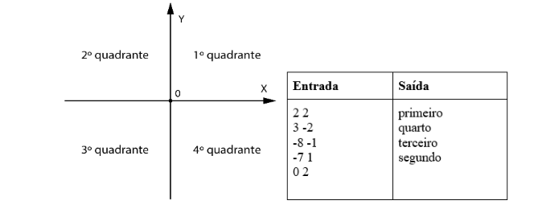

# Lista de Exercícios 02

1. Escreva um programa para ler as coordenadas (X,Y) de uma quantidade indeterminada de pontos no sistema cartesiano. Para cada ponto escrever o quadrante a que ele pertence. O algoritmo será encerrado quando a coordenada X ou Y for NULA (nesta situação não escrever/exibir nenhuma mensagem). A tabela ao lado exibe exemplos de entradas e saídas de dados. Utilizar o comando while.

---
---

2. A funerária Sua Hora Chegou possui vários caixões. O algoritmo deverá cadastrar o código dos caixões até o usuário digitar -1 (quando digitar -1 ele encerra) e sair do cadastro. Por fim, o algoritmo mostrará o número de caixões cadastrados. Utilize o while.

---
---

3. Carla é uma profissional muito dedicada! Ela é responsável por analisar o pH de várias substâncias e determinar se elas são ácidas, básicas ou neutras. Ela não para enquanto não tiver terminado de analisar todas as soluções. Escreva um programa para ajudar a nossa querida Carla no seu trabalho. O programa vai receber números inteiros como entrada, apresentando o pH de cada solução (para cada número digitado). A última entrada vai ser o número -1, indicando que não há mais soluções para serem analisadas e o programa pode encerrar. 
Para cada solução, o programa vai determinar a sua acidez: ACIDA (pH menor que 7), BASICA (pH maior que 7), ou NEUTRA (pH igual a 7). Utilize a estrutura while. O -1 não deve ser considerado na verificação do pH.

---
---

4. Receba o nome de 2 times e o número de gols marcados na partida (para cada time). Após receber os dados, exiba na tela o nome do vencedor. Caso não haja vencedor deverá ser impressa a palavra EMPATE. 
NÃO precisa utilizar o while, apenas condicionais.

